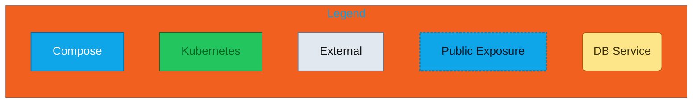

# System Architecture (auto-generated)

```mermaid
%%{init: {'theme':'base','flowchart':{'curve':'monotoneX'},'themeVariables':{'primaryColor':'#0ea5e9','primaryTextColor':'#111827','lineColor':'#0ea5e9'}}}%%
flowchart LR
  classDef compose fill:#0ea5e9,stroke:#0369a1,color:#fff,stroke-width:1px;
  classDef k8s fill:#22c55e,stroke:#166534,color:#062;
  classDef external fill:#e2e8f0,stroke:#64748b,color:#111;
  classDef public stroke-dasharray: 3 2,stroke-width:2px;
  classDef db fill:#fde68a,stroke:#b45309,color:#3b2f00;
  %% Legend
  subgraph Legend
    legend_compose[Compose]:::compose
    legend_k8s[Kubernetes]:::k8s
    legend_ext[External]:::external
    legend_pub[Public Exposure]:::public
    legend_db(DB Service):::db
  end
```

Compose: 0 · K8s: 0 · External: 0 · Frameworks: n/a

> Generated by **repo-architecture-map** (zero deps). Edit freely after generation.
